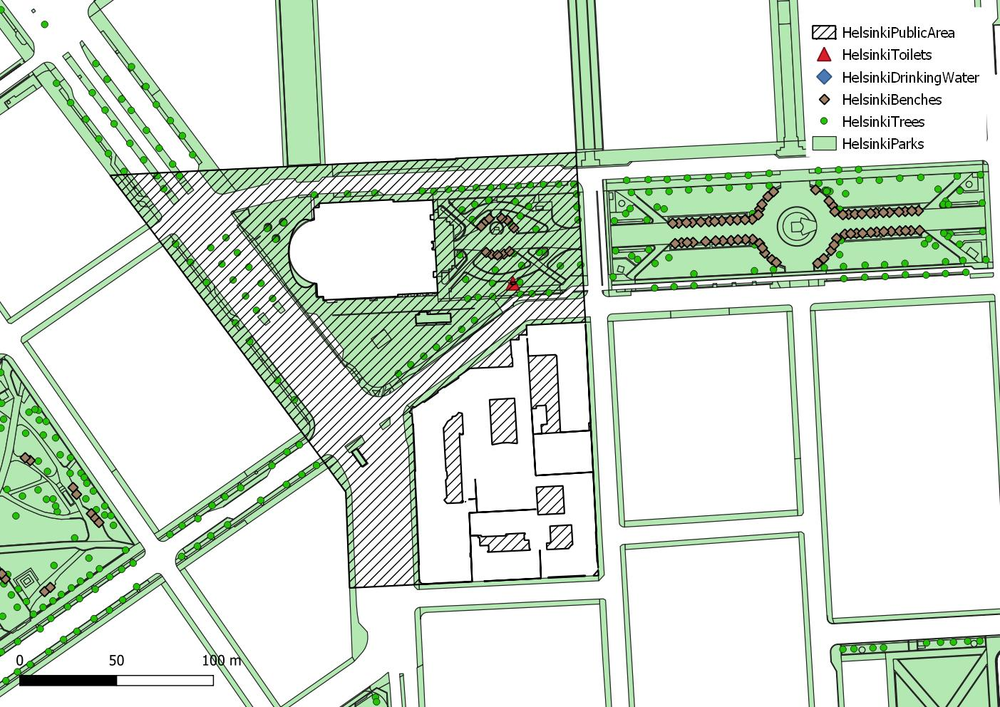
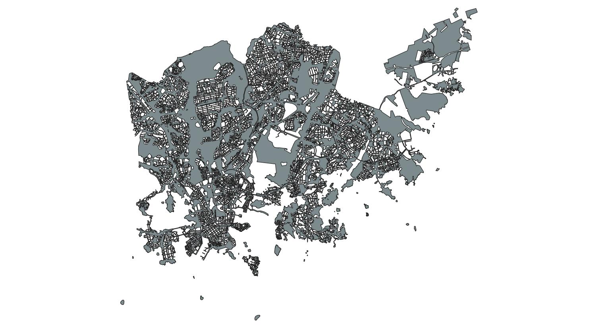

# Analysis area definition

## Small test site

Several different [area divisions](https://hri.fi/data/en_GB/dataset/helsingin-piirijako) are available for the City of Helsinki. The following query loads a single small area polygon from the downtown Helsinki:

	https://kartta.hel.fi/ws/geoserver/avoindata/wfs?service=wfs&version=2.0.0&request=GetFeature&typeNames=avoindata:Piirijako_pienalue&count=10&outputFormat=application/json&srsName=urn:ogc:def:crs:EPSG::4326&featureID=112650

[Load as GeoJSON](https://kartta.hel.fi/ws/geoserver/avoindata/wfs?service=wfs&version=2.0.0&request=GetFeature&typeNames=avoindata:Piirijako_pienalue&count=10&outputFormat=application/json&srsName=urn:ogc:def:crs:EPSG::4326&featureID=112650)

For the GCI estimation, an edited version of the polygon was created by removing the building outlines from the administrative area. The operation was performed in QGIS. The resulting test area is shown hatched below.

## Data for entire Helsinki administrative area

Alternatively, a dataset covering the entire Helsinki was generated by merging all area features from the register of public areas, applying a small buffer to eliminate minor geometric issues.

