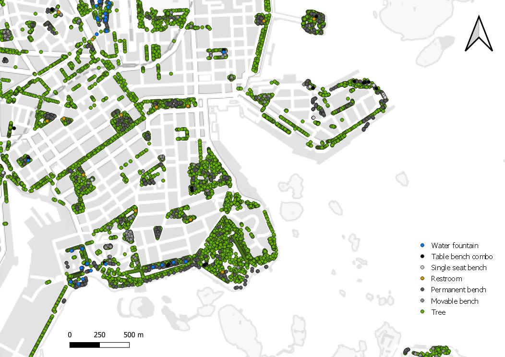

# UrbanageGCI - Source data from Helsinki

To facilitate piloting the Green Comfort Index in Helsinki, a number of open geospatial data sources provided by the city are utilized. These are available from an open WFS API. Below, the data sets are briefly described with example query URLs used to retrieve them.

## Amenities

For amenities such as city furniture, most of the data is maintained in the [REGISTER OF PUBLIC AREAS IN THE CITY OF HELSINKI](https://hri.fi/data/en_GB/dataset/helsingin-kaupungin-yleisten-alueiden-rekisteri) as 2D point features. 

> The register of public areas (YLRE) is a system of the Helsinki Urban Environment Division that contains information about the city’s street and green areas. The dataset is maintained for the use of the division and does not, as a rule, cover the assets in public areas that are the responsibility of the City of Helsinki’s other organisational departments or institutions. The information in the register of public areas is used to order maintenance for street and park areas in Helsinki. The information in the register is used, for example, in reporting on the activities of the Street and Park Department and in asset management of public areas.

The data is available with a [Creative Commons Attribution 4.0](https://creativecommons.org/licenses/by/4.0/) license. If all of the layers listed below are combined, a resulting collection of points is formed:

### Park benches

#### Public, permanent park benches in Helsinki (maintained by the city)

[10 first features as WGS84 GeoJSON](https://kartta.hel.fi/ws/geoserver/avoindata/wfs?service=wfs&version=2.0.0&request=GetFeature&typeNames=avoindata:YLRE_Viherosat_piste&count=10&outputFormat=application/json&srsName=urn:ogc:def:crs:EPSG::4326&CQL_FILTER=alatyyppi%20LIKE%20%27%25Kiintopenkki%25%27)
	
	https://kartta.hel.fi/ws/geoserver/avoindata/wfs?service=wfs&version=2.0.0&request=GetFeature&typeNames=avoindata:YLRE_Viherosat_piste&count=10&outputFormat=application/json&srsName=urn:ogc:def:crs:EPSG::4326&CQL_FILTER=alatyyppi%20LIKE%20%27%25Kiintopenkki%25%27

The query may return a total of 5519 items. [Load all as WGS84 GeoJSON](https://kartta.hel.fi/ws/geoserver/avoindata/wfs?service=wfs&version=2.0.0&request=GetFeature&typeNames=avoindata:YLRE_Viherosat_piste&count=10000&outputFormat=application/json&srsName=urn:ogc:def:crs:EPSG::4326&CQL_FILTER=alatyyppi%20LIKE%20%27%25Kiintopenkki%25%27)

#### Public, movable park benches

[10 first features as WGS84 GeoJSON](https://kartta.hel.fi/ws/geoserver/avoindata/wfs?service=wfs&version=2.0.0&request=GetFeature&typeNames=avoindata:YLRE_Viherosat_piste&count=10&outputFormat=application/json&srsName=urn:ogc:def:crs:EPSG::4326&CQL_FILTER=alatyyppi%20LIKE%20%27%25Irtopenkki%25%27)
	
	https://kartta.hel.fi/ws/geoserver/avoindata/wfs?service=wfs&version=2.0.0&request=GetFeature&typeNames=avoindata:YLRE_Viherosat_piste&count=10&outputFormat=application/json&srsName=urn:ogc:def:crs:EPSG::4326&CQL_FILTER=alatyyppi%20LIKE%20%27%25Irtopenkki%25%27

The query may return a total of 734 items. [Load all as WGS84 GeoJSON](https://kartta.hel.fi/ws/geoserver/avoindata/wfs?service=wfs&version=2.0.0&request=GetFeature&typeNames=avoindata:YLRE_Viherosat_piste&count=10000&outputFormat=application/json&srsName=urn:ogc:def:crs:EPSG::4326&CQL_FILTER=alatyyppi%20LIKE%20%27%25Irtopenkki%25%27)

#### Public, single seat benches

[10 first features as WGS84 GeoJSON](https://kartta.hel.fi/ws/geoserver/avoindata/wfs?service=wfs&version=2.0.0&request=GetFeature&typeNames=avoindata:YLRE_Viherosat_piste&count=10&outputFormat=application/json&srsName=urn:ogc:def:crs:EPSG::4326&CQL_FILTER=alatyyppi%20LIKE%20%27%25Yhdenistuttava%20penkki%25%27)
	
	https://kartta.hel.fi/ws/geoserver/avoindata/wfs?service=wfs&version=2.0.0&request=GetFeature&typeNames=avoindata:YLRE_Viherosat_piste&count=10&outputFormat=application/json&srsName=urn:ogc:def:crs:EPSG::4326&CQL_FILTER=alatyyppi%20LIKE%20%27%25Yhdenistuttava%20penkki%25%27
	
The query may return a total of 33 items. [Load all as WGS84 GeoJSON](https://kartta.hel.fi/ws/geoserver/avoindata/wfs?service=wfs&version=2.0.0&request=GetFeature&typeNames=avoindata:YLRE_Viherosat_piste&count=1000&outputFormat=application/json&srsName=urn:ogc:def:crs:EPSG::4326&CQL_FILTER=alatyyppi%20LIKE%20%27%25Yhdenistuttava%20penkki%25%27)

#### Table & bench combinations

[10 first features as WGS84 GeoJSON](https://kartta.hel.fi/ws/geoserver/avoindata/wfs?service=wfs&version=2.0.0&request=GetFeature&typeNames=avoindata:YLRE_Viherosat_piste&count=10&outputFormat=application/json&srsName=urn:ogc:def:crs:EPSG::4326&CQL_FILTER=alatyyppi%20LIKE%20%27%25Pöytä-penkki%20yhdistelmä%25%27)
	
	https://kartta.hel.fi/ws/geoserver/avoindata/wfs?service=wfs&version=2.0.0&request=GetFeature&typeNames=avoindata:YLRE_Viherosat_piste&count=10&outputFormat=application/json&srsName=urn:ogc:def:crs:EPSG::4326&CQL_FILTER=alatyyppi%20LIKE%20%27%25Pöytä-penkki%20yhdistelmä%25%27
	
The query may return a total of 634 items. [Load all as WGS84 GeoJSON](https://kartta.hel.fi/ws/geoserver/avoindata/wfs?service=wfs&version=2.0.0&request=GetFeature&typeNames=avoindata:YLRE_Viherosat_piste&count=1000&outputFormat=application/json&srsName=urn:ogc:def:crs:EPSG::4326&CQL_FILTER=alatyyppi%20LIKE%20%27%25Pöytä-penkki%20yhdistelmä%25%27)

#### Public restrooms

[10 first features as WGS84 GeoJSON](https://kartta.hel.fi/ws/geoserver/avoindata/wfs?service=wfs&version=2.0.0&request=GetFeature&typeNames=avoindata:YLRE_Viherosat_piste&count=10&outputFormat=application/json&srsName=urn:ogc:def:crs:EPSG::4326&CQL_FILTER=alatyyppi%20LIKE%20%27%25Yleisökäymälä%25%27)
	
	https://kartta.hel.fi/ws/geoserver/avoindata/wfs?service=wfs&version=2.0.0&request=GetFeature&typeNames=avoindata:YLRE_Viherosat_piste&count=10&outputFormat=application/json&srsName=urn:ogc:def:crs:EPSG::4326&CQL_FILTER=alatyyppi%20LIKE%20%27%25Yleisökäymälä%25%27
	
The query may return a total of 52 items. [Load all as WGS84 GeoJSON](https://kartta.hel.fi/ws/geoserver/avoindata/wfs?service=wfs&version=2.0.0&request=GetFeature&typeNames=avoindata:YLRE_Viherosat_piste&count=1000&outputFormat=application/json&srsName=urn:ogc:def:crs:EPSG::4326&CQL_FILTER=alatyyppi%20LIKE%20%27%25Yleisökäymälä%25%27)

## Drinking water fountains

Positions of water posts in the Helsinki metropolitan area are maintained by Helsinki Region Environmental Services HSY, and available as [open data](https://www.hsy.fi/en/environmental-information/open-data/avoin-data---sivut/water-posts-in-the-helsinki-metropolitan-area/).

[10 first features as WGS84 GeoJSON](https://kartta.hsy.fi/geoserver/wfs?service=wfs&version=2.0.0&request=GetFeature&typeNames=vesihuolto:VH_Vesipostit_HSY&outputFormat=application/json&srsName=urn:ogc:def:crs:EPSG::4326&count=10)

	https://kartta.hsy.fi/geoserver/wfs?service=wfs&version=2.0.0&request=GetFeature&typeNames=vesihuolto:VH_Vesipostit_HSY&outputFormat=application/json&srsName=urn:ogc:def:crs:EPSG::4326

The query may return a total of 67 features. [Load all as WGS84 GeoJSON](https://kartta.hsy.fi/geoserver/wfs?service=wfs&version=2.0.0&request=GetFeature&typeNames=vesihuolto:VH_Vesipostit_HSY&outputFormat=application/json&srsName=urn:ogc:def:crs:EPSG::4326&count=1000)

## Trees

Roadside trees maintained by the city are listed in the [URBAN TREE DATABASE OF THE CITY OF HELSINKI](https://hri.fi/data/en_GB/dataset/helsingin-kaupungin-puurekisteri) as 2D point features. 

The data is available with a [Creative Commons Attribution 4.0](https://creativecommons.org/licenses/by/4.0/) license.

[10 first features as WGS84 GeoJSON](https://kartta.hel.fi/ws/geoserver/avoindata/wfs?service=wfs&version=2.0.0&request=GetFeature&typeNames=avoindata:Puurekisteri_piste&count=10&outputFormat=application/json&srsName=urn:ogc:def:crs:EPSG::4326)
	
	https://kartta.hel.fi/ws/geoserver/avoindata/wfs?service=wfs&version=2.0.0&request=GetFeature&typeNames=avoindata:Puurekisteri_piste&count=10&outputFormat=application/json&srsName=urn:ogc:def:crs:EPSG::4326	
	
The query may return a total of 53744 items. [Load all as WGS84 GeoJSON](https://kartta.hel.fi/ws/geoserver/avoindata/wfs?service=wfs&version=2.0.0&request=GetFeature&typeNames=avoindata:Puurekisteri_piste&count=100000&outputFormat=application/json&srsName=urn:ogc:def:crs:EPSG::4326)

